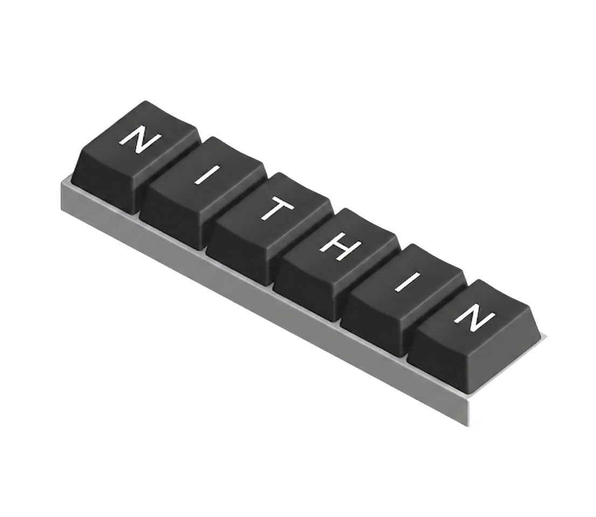

<!DOCTYPE html>
<html lang="en">
<head>
  <meta charset="UTF-8">
  <meta name="viewport" content="width=device-width, initial-scale=1.0">
  <meta name="description" content="Nithin Prasad — Assistant Systems Engineer, Android App Developer and AI-focused software developer.">
  <title>Nithin Prasad — Portfolio</title>

  <link rel="preconnect" href="https://fonts.googleapis.com">
  <link rel="preconnect" href="https://fonts.gstatic.com" crossorigin>
  <link href="https://fonts.googleapis.com/css2?family=Quicksand:wght@300;400;500;600;700&display=swap" rel="stylesheet">

  <!-- Devicon gives the technology logos used in the Technologies section. -->
  <link rel="stylesheet"
        href="https://cdn.jsdelivr.net/gh/devicons/devicon@latest/devicon.min.css">

  
</head>

<body>

  <!-- =======================================================
       OPENING SCREEN
       Image: assets/docs/nithin-prasad-signature.png
       ======================================================= -->
  <section id="intro" aria-label="Portfolio introduction">
    

      

      
Assistant Systems Engineer

      <button class="see-portfolio" id="seePortfolio">
        See Portfolio
      </button>
    

  </section>

  <!-- =======================================================
       MAIN CONTENT — hidden until See Portfolio is clicked
       ======================================================= -->
  <main id="portfolio">

    <nav class="nav" aria-label="Main navigation">
      

        <a href="#about" class="active">About Me</a>
        <a href="#experience">Experience</a>
        <a href="#projects">Projects</a>
        <a href="#contact">Contact</a>
      

    </nav>

    <!-- HERO -->
    <section id="about" class="section">
      

        

          <h1 class="hero-name">Nithin Prasad</h1>

          <h2 class="hero-role">
            Assistant Systems Engineer
          </h2>

          

            Building intelligent systems, Android applications, and practical
            software with Python, Flutter, Firebase and AI.
          

          

            <a class="btn primary" href="#projects">View Projects</a>
            <a class="btn secondary" href="#contact">Get in Touch</a>
          

        

        

          <!-- Replace this file with the keyboard image supplied by you. -->
          
          
SYSTEMS · MOBILE · AI

        

      

      

        Scroll to explore
        

      

    </section>

    <!-- ABOUT -->
    <section class="section about">
      <h2 class="section-title reveal">About Me</h2>

      

        

          

            I am a software developer focused on building useful, intelligent
            systems and practical applications. My work spans Python,
            Android, Flutter, Firebase, web development and AI-driven
            automation.
          

          

            I enjoy turning ideas into working products — from mobile
            applications and full-stack platforms to AI-assisted systems.
          

        

        

          

            04
            Selected Projects
          

          

            03
            Leadership Roles
          

          

            6.7
            BCA CGPA / 10
          

          

            AI
            Systems Focus
          

        

      

    </section>

    <!-- EXPERIENCE -->
    <section id="experience" class="section">
      <h2 class="section-title reveal">Experience</h2>

      

        <article class="timeline-item reveal">
          <h3 class="item-title">Assistant Systems Engineer</h3>
          
Software Engineering · AI / Automation

          

            Building practical software systems, automation workflows and
            AI-assisted applications with a focus on reliability and
            real-world usability.
          

          

            Python
            AI
            Automation
            Software Engineering
          

        </article>

        <article class="timeline-item reveal">
          <h3 class="item-title">Android App Development</h3>
          
Mobile Development

          

            Developing Android applications and integrating application
            services with Firebase-backed infrastructure.
          

          

            Android
            Java
            Firebase
          

        </article>
      

    </section>

    <!-- PROJECTS -->
    <section id="projects" class="section about">
      <h2 class="section-title reveal">Projects</h2>

      

        <article class="project-card reveal">
          <h3>Insight Gen</h3>
          

            Agentic AI platform for autonomous data analysis and professional
            report generation from natural-language queries through
            multi-agent orchestration.
          

          

            Python
            CrewAI
            Streamlit
            Pandas
          

        </article>

        <article class="project-card reveal">
          <h3>Revo</h3>
          

            Social news Android application with content rating and
            real-time community discussion backed by Firebase.
          

          

            Java
            Android
            Firebase
          

        </article>

        <article class="project-card reveal">
          <h3>Profexia</h3>
          

            Full-stack skill-barter platform enabling community-driven
            exchange without financial dependency.
          

          

            Django
            Python
            SQL
          

        </article>

        <article class="project-card reveal">
          <h3>Vaccination Manager</h3>
          

            Child vaccination tracking system with automated notification
            schedules and intelligent reminders.
          

          

            JavaScript
            HTML5
            SQL
          

        </article>

      

    </section>

    <!-- TECHNOLOGIES -->
    <section class="section tech-section">
      <h2 class="section-title reveal">Technologies</h2>

      

        

          <i class="devicon-python-plain"></i>
          Python
        

        

          <i class="devicon-flutter-plain"></i>
          Flutter
        

        

          <i class="devicon-android-plain"></i>
          Android
        

        

          <i class="devicon-firebase-plain"></i>
          Firebase
        

        

          <i class="devicon-django-plain"></i>
          Django
        

        

          <i class="devicon-javascript-plain"></i>
          JavaScript
        

        

          <i class="devicon-git-plain"></i>
          Git
        

      

    </section>

    <!-- EDUCATION -->
    <section class="section">
      <h2 class="section-title reveal">Education</h2>

      

        <article class="education-item reveal">
          
2024 – Now

          

            <h3 class="edu-degree">Master of Computer Applications</h3>
            

              Adi Shankara Institute of Engineering and Technology, Kalady
            

            MCA
          

        </article>

        <article class="education-item reveal">
          
2021 – 2024

          

            <h3 class="edu-degree">Bachelor of Computer Applications</h3>
            

              DePaul Institute of Science and Technology, Angamaly
            

            BCA · CGPA 6.7 / 10
          

        </article>

      

    </section>

    <!-- CONTACT -->
    <section id="contact" class="section contact">
      <h2 class="section-title reveal">Let's Connect</h2>
      

        Have a project in mind or want to collaborate? Get in touch!
      

      

        <form class="contact-form reveal"
              action="https://formspree.io/f/YOUR_FORM_ID"
              method="POST">
          <input type="text" name="name" placeholder="Name" required>
          <input type="email" name="email" placeholder="Email" required>
          <textarea name="message" placeholder="Message" required></textarea>
          <button class="btn primary" type="submit">Send Message</button>
        </form>

        

          <h3>Connect With Me</h3>

          

            <a href="https://github.com/" target="_blank" rel="noopener" aria-label="GitHub">
              <i class="devicon-github-original"></i>
            </a>
            <a href="https://www.linkedin.com/" target="_blank" rel="noopener" aria-label="LinkedIn">
              <i class="devicon-linkedin-plain"></i>
            </a>
          

          

            
Location: Kerala, India

            
Open to software, Android and AI opportunities.

          

        

      

    </section>

    <footer>
      © 2026 Nithin Prasad.
    </footer>

  </main>

  

</body>
</html>
